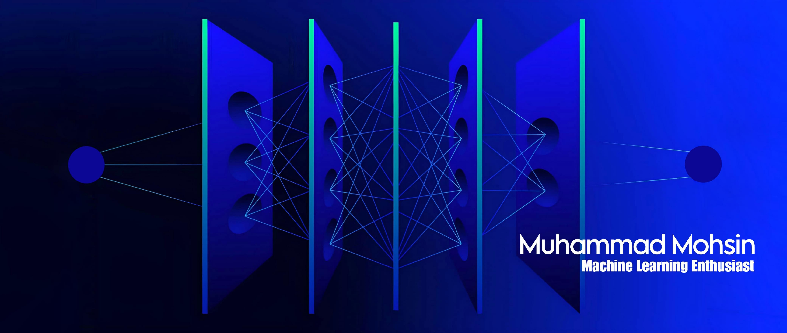

<h1 align="center">Hi there 👋, I'm Muhammad Mohsin</h1>
<h3 align="center">Passionate about a career in machine learning | From Pakistan 🇵🇰</h3>

I'm a dedicated machine learning enthusiast from Pakistan, deeply interested in exploring the frontiers of AI and data science. Follow along as I journey through the realms of coding and machine intelligence!

- 🌱 I’m currently learning **EDA and Feature engineering and looking forward to machine learning**

- 💬 Ask me about **Numpy, Pandas and Matplotlib**

- 📫 How to reach me **mohsinmuhammad823@gmail.com**

- ⚡ Fun fact **i think am excel at gaming**

<h3 align="left">Connect with me:</h3>

<h3 align="left">Languages and Tools:</h3>

          

