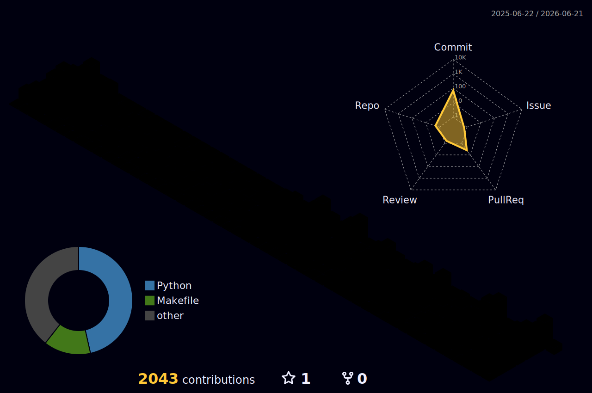

  

  <i>Software engineer with production backend experience, currently deepening work in applied AI and system design.</i>
   
  <i>Focused on building systems that are reliable in production, not just impressive in demos.</i>

  

## About Me

- Backend engineer at an AI company in Lahore — where reliability is not optional and demos don't count.
- Currently building a **motorcycle blind spot detection system** as thesis research: CARLA simulation, IMU lean-angle filtering, and radar/camera fusion across 8 adversarial driving scenarios. The core idea — suppressing false positives caused by road lean — is the kind of problem that only shows up when you go past the happy path.
- Previously shipped a **Gmail template testing tool** that automated full Jinja2 branch coverage and cut QA time from 15 minutes to 2 minutes per template.
- ⚡ Still early in the journey — but I know the difference between a working demo and a production system, and I aim for the latter.

## 🛠️ Technologies & Tools

**Simulation & Research**

  
  
  
  
  
  

**AI & Agents**

  
  
  

**Backend**

  
  
  
  
  
  
  

**Infrastructure & DevOps**

  
  
  
  
  

<h3 align="center">GitHub Stats </h3>

  

  

<h2 align="center"> 🔗 Connect With Me </h2>

  
  <a href="https://www.linkedin.com/in/volcann/">
    

  <i>Appreciate you stopping by. Always happy to connect, learn, and build meaningful things.</i>

> ⭐️ Fun Fact: I believe curiosity drives learning, so I'm always exploring new ideas, solving problems, and building things that challenge me.

<picture>
    <source media="(prefers-color-scheme: dark)" srcset="./profile-3d-contrib/profile-night-rainbow.svg" />
    
</picture>

